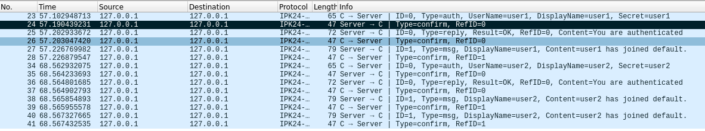
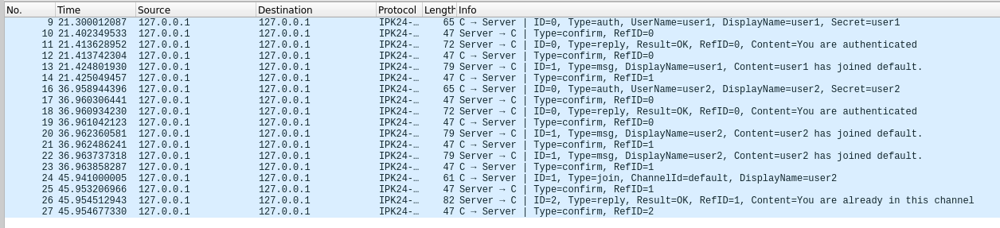

# IPK Project 1: Client for a chat server

## Autor: Aliaksei Klimau (xklima34)

### Note:  

Only UDP protocol was fully implemented

# Table of Contents

  
  

1. [**Theory**](#theory)

2. [**Interesting code sections**](#interesting-code-sections)

3. [**Testing**](#testing)

4. [**Bibliography**](#bibliography)

  

## Theory

### What is the User Datagram Protocol (UDP/IP)?

  

The User Datagram Protocol, or UDP, is a communication protocol used across the Internet for especially time-sensitive transmissions such as video or DNS lookups. It speeds up communications by not formally establishing a connection before data is transferred. This allows data to be transferred very quickly, but it can also cause packets to become lost in transit — and create opportunities for exploitation in the form of DDoS attacks. [(1)](#bibliography)

  

### User Datagram Protocol Architecture

The user datagram protocol packets are normally called User Datagram & the header size is fixed i.e 8 bytes. Let us discuss the user datagram format. The header of UDP includes four fields source port number, destination port number, total length, and checksum where each field is discussed below.

  

[(2)](https://stackedit.io/app#bibliography)


### Applications of UDP
  User Datagram Protocol (UDP) is used for:

1.  The straightforward request/response communication of relatively small amounts of data, eliminating concerns regarding controlling errors or the flow of the packets
2.  Multicasting because UDP works well with packet switching
3.  Routing update protocols such as Routing Information Protocol (RIP)
4.  Real-time applications in which the information needs to be delivered quickly and smoothly
5.  The following implementations where it is a useful transport layer protocol: 
-   Network Time Protocol (NTP)
-   Network News Protocol (NNP)
-   Dynamic Host Configuration Protocol (DHCP)
- Bootstrap Protocol (BOOTP)
-   Real Time Streaming Protocol (RTSP), Trivial File Transfer Protocol (TFTP), RIP
-   Quote of the Day Protocol (QOTD)
-   DNS     [(3)](#bibliography)


## Quick code overview
1. **Listener Setup**: The program sets up a listener to await the initial message from a client. This is done using an asynchronous loop that continuously listens for incoming UDP packets.
	```csharp
 while (true) { 
		UdpReceiveResult result = await udpListener.ReceiveAsync();  
		ProcessMessage(result);
	}
	```
2. **Message Processing**: When a message is received, it is processed using the `ProcessMessage` method. This method parses the message, and creates tasks for handling the client communication:
	```csharp
	static async Task ProcessMessage(UdpReceiveResult result) {  
		Message? messageParsed = null; 
		try { messageParsed = MessageToBytesConverter.BytesToMessage(result.Buffer);}
	  	catch (MessageConvertException e) { return; } 
	  	LogMessageReceived(result.RemoteEndPoint, messageParsed); 
	  	// Client creation 
	  	IPEndPoint clientEP = result.RemoteEndPoint;  
	  	UdpClient? localEP = new UdpClient(); 
	  	localEP.Client.Bind(new IPEndPoint(IPAddress.Any, 0)); 
	  	Client? client = new Client(clientEP, localEP);
	  	client.MessagesUprocessed.Add(messageParsed); 
	  	var sender = Task.Run(() => SenderAsync(client));
	  	var listener = Task.Run(() => ListenerAsync(client)); 
  	}
	```
3. **Client Communication**: Each client is managed asynchronously using separate tasks for sending and receiving messages:

-   `SenderAsync`: This task continuously checks for unprocessed messages from the client queue, processes and sends them.
-   `ListenerAsync`: This task listens for incoming messages from the client and processes them accordingly.
- `Client` class  encapsulates  all  necessary  information  about  a  client, including  its  properties  like `Username`, `DisplayName`, client's end-point, and  collections  for  storing  confirmations, unprocessed  messages, and  sent  bytes. This  allows  for  concurrent  handling  of  multiple  clients, with  each  client  being  managed  independently  by  its  own  sender  and  listener  tasks.
## UML Diagram


## Testing

### Authentication of 2 clients

**Description:** Authenticate two instances of the ipk24-client application with different user credentials.
-   **Steps:**
    1.  Run the ipk24-client application on two separate instances.
    2.  Authenticate from each instance using the following input:
        -   Instance 1: `/auth user1 user1 user1` (where `user1` is authenticated first)
        -   Instance 2: `/auth user2 user2 user2`
  -   **Expected Outcome:** Both instances should successfully authenticate with the server. 
  - **Server output:** 
 RECV 127.0.0.1:59930 | AUTH 
SENT 127.0.0.1:59930 | CONFIRM 
SENT 127.0.0.1:59930 | REPLY You are authenticated
RECV 127.0.0.1:59930 | CONFIRM 
SENT 127.0.0.1:59930 | MSG user1 has joined default.
RECV 127.0.0.1:59930 | CONFIRM 
RECV 127.0.0.1:59272 | AUTH 
SENT 127.0.0.1:59272 | CONFIRM 
SENT 127.0.0.1:59272 | REPLY You are authenticated
RECV 127.0.0.1:59272 | CONFIRM 
SENT 127.0.0.1:59272 | MSG user2 has joined default.
RECV 127.0.0.1:59272 | CONFIRM 
SENT 127.0.0.1:59930 | MSG user2 has joined default.
RECV 127.0.0.1:59930 | CONFIRM 
- **Wireshark output:**


  

### Client joining channel they are already in 
**Description:** Authenticate two instances of the ipk24-client application with different user credentials.
-   **Steps:**
    1.  Run the ipk24-client application on two separate instances.
    2.  Authenticate from each instance using the following input:
        -   Instance 1: `/auth user1 user1 user1` (where `user1` is authenticated first)
        -   Instance 2: `/auth user2 user2 user2`
      3. User2 tries to join default channel
      -   Instance 2: `/join default`
  -   **Expected Outcome:** User2 gets reply success, broadcast doesn't happen.
  - **Server output:** 
RECV 127.0.0.1:55987 | AUTH 
SENT 127.0.0.1:55987 | CONFIRM 
SENT 127.0.0.1:55987 | REPLY You are authenticated
RECV 127.0.0.1:55987 | CONFIRM 
SENT 127.0.0.1:55987 | MSG user1 has joined default.
RECV 127.0.0.1:55987 | CONFIRM 
RECV 127.0.0.1:55442 | AUTH 
SENT 127.0.0.1:55442 | CONFIRM 
SENT 127.0.0.1:55442 | REPLY You are authenticated
RECV 127.0.0.1:55442 | CONFIRM 
SENT 127.0.0.1:55442 | MSG user2 has joined default.
RECV 127.0.0.1:55442 | CONFIRM 
SENT 127.0.0.1:55987 | MSG user2 has joined default.
RECV 127.0.0.1:55987 | CONFIRM 
RECV 127.0.0.1:55442 | JOIN 
SENT 127.0.0.1:55442 | CONFIRM 
SENT 127.0.0.1:55442 | REPLY You are already in this channel
RECV 127.0.0.1:55442 | CONFIRM 

- **Wireshark output:**



## Bibliography

(1) Everything you ever wanted to know about UDP sockets but were afraid to ask, part 1

https://blog.cloudflare.com/everything-you-ever-wanted-to-know-about-udp-sockets-but-were-afraid-to-ask-part-1

(2) User Datagram Protocol : Architecture, Working & Its Applications

https://www.elprocus.com/user-datagram-protocol/

(3) What Is User Datagram Protocol (UDP)?
https://www.fortinet.com/resources/cyberglossary/user-datagram-protocol-udp